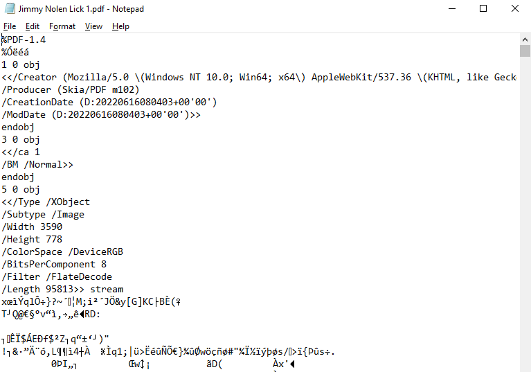

### 1.2 File Processing I - Text File

Disclaimer: *This article abstract away the complexity of computer science. Some of the explanation will not be exactly correct in the computer science perspective. This is to keep this article to be as simple as possible.*

In this subtopic, we will look into text file processing in python. Let’s start by understand the type of files. Fundamentally, all files are stored as binary file, which consists of a bunch of 1 and 0. But for this topic, we are not going to look into the theory of how file work exactly in computer. To the common computer users, there are 2 types of file, one is text file which is human-readable like txt, csv, etc., another one is binary file which is human-unreadable such as exe, zip, pdf, etc. 

Wait, what!? you are saying pdf is not human-readable? But, I can just read the pdf file just fine🤨. Yeah, I know, but here I am going to define human-unreadable file as the file that you cannot understand its content if you open it with notepad. With the right software (like any pdf viewer software), you can read the content of the pdf file. But, if you opening it up with notepad, you will just see a bunch of weird character, which is pretty much unreadable.



So, why are we define it in this way? Because this is related to what we going to learn in this lesson. In python, when reading a file using python default `open()` function, it is going to read the file in text mode, human readable file such as txt and csv can be open with the default text mode. However, file type such as pdf and docx are considered as binary file, the file cannot be open with the default text mode of `open()` function, unless it is being specified to open the file in the binary mode. 

Let’s recall again, there are 2 types of file, which are text file and binary file. In this lesson, we are going to look into dealing with text file in python. Your reading for this lesson will consists of two main items, File Handling and Text Processing. File Handling will cover read, write operation, and dealing with text, csv, and json. Text processing will cover string operation, simple regex for exact string search, and fuzzy search for approximate string search. Be noted that regex is a difficult topic and takes time to learn, we will only look into the basic and giving an overview to it.

**Your reading:**

<ins>File Handling</ins>

1. [File Handling in Python – How to Create, Read, and Write to a File (freecodecamp.org)](https://www.freecodecamp.org/news/file-handling-in-python/)
2. [Tutorial: How to Easily Read Files in Python (Text, CSV, JSON) (dataquest.io)](https://www.dataquest.io/blog/read-file-python/)
3. [Working with text files in Python - Quick start | Ansys Developer Portal](https://developer.ansys.com/blog/working-text-files-python-quick-start)
4. [XML & ElementTree || Python Tutorial || Learn Python Programming - YouTube](https://www.youtube.com/watch?v=j0xr0-IAqyk) (xml is hard, just learn enough to tackle the exercise 2 is enough)
5. [Python XML Tutorial: Element Tree Parse & Read | DataCamp](https://www.datacamp.com/tutorial/python-xml-elementtree)

<ins>Text Processing</ins>

1. [Python Strings (With Examples) (programiz.com)](https://www.programiz.com/python-programming/string)
2. [[5 Minute Tutorial] Regular Expressions (Regex) in Python (youtube.com)](https://www.youtube.com/watch?v=UQQsYXa1EHs)
3. [Regex Cheat Sheet — Regular Expressions in Python | DataCamp](https://www.datacamp.com/cheat-sheet/regular-expresso) (for reference only)
4. [Fuzzy String Matching in Python: Intro to Fuzzywuzzy | Built In](https://builtin.com/data-science/fuzzy-matching-python)

### Exercise/Quiz
1. Download/Clone the repository, you exercise is in the [exercise folder](exercise).
2. For exercise, follow in instruction complete the code in [exercise_1.py](exercise/exercise_1.py), [exercise_2.py](exercise/exercise_2.py), and [exercise_3.py](exercise/exercise_3.py).
3. See [expected_output](exercise/expected_output/) folder to check on your answer.

### Challenge
1. Download/Clone the repository, you challenge question is in the [challenge folder](challenge/question.txt).
2. Read the [question.md](challenge/question.md) for instruction.
3. Write the code to complete the challenge, use the files in "images" folder for your challenge.
4. Run [validate_answer.py](challenge/validate_answer.py) to validate your answer. It should pass all the tests.
    ```python
    python3 validate_answer.py
    ```
